# Sistema Académico con Árbol Binario de Búsqueda en Java

## Descripción del proyecto

Este proyecto consiste en el desarrollo de un sistema académico utilizando Árboles Binarios de Búsqueda (BST) en Java para gestionar estudiantes de la Universidad Técnica de Ambato.

El sistema permite almacenar información de estudiantes de manera organizada utilizando la cédula como clave principal dentro del árbol binario.

Además, el proyecto implementa distintos recorridos del árbol, búsqueda, eliminación de nodos, cálculo de altura, conteo de estudiantes y clasificación de aprobados y reprobados.

---

# Objetivo general

Implementar un sistema académico mediante Árboles Binarios de Búsqueda aplicando Programación Orientada a Objetos, recursividad y estructuras dinámicas en Java.

---

# Datos almacenados de cada estudiante

Cada estudiante contiene la siguiente información:

- Cédula
- Apellidos
- Nombres
- Nota final
- Carrera
- Nivel

---

# Funciones implementadas

El sistema implementa las siguientes funciones:

- Insertar estudiante
- Buscar estudiante por cédula
- Eliminar estudiante
- Recorrido Inorden
- Recorrido Preorden
- Recorrido Postorden
- Recorrido por niveles BFS
- Contar estudiantes
- Calcular altura del árbol
- Buscar estudiante con mayor nota
- Buscar estudiante con menor nota
- Mostrar estudiantes aprobados
- Mostrar estudiantes reprobados

---

# Tecnologías utilizadas

- Java
- Visual Studio Code
- GitHub

---

# Conceptos aplicados

Durante el desarrollo del proyecto se aplicaron los siguientes conceptos:

- Árboles Binarios de Búsqueda (BST)
- Programación Orientada a Objetos
- Recursividad
- Clases y objetos
- Referencias en Java
- Colas para recorrido BFS
- Métodos recursivos
- Modularización del código

---

# Explicación del funcionamiento del sistema

El sistema utiliza un Árbol Binario de Búsqueda para organizar estudiantes utilizando la cédula como criterio principal.

## Funcionamiento del BST

- Si la cédula es menor que la del nodo actual, el estudiante se inserta a la izquierda.
- Si la cédula es mayor, se inserta a la derecha.

Esto permite realizar búsquedas eficientes y mantener la información organizada automáticamente.

---

# Explicación de las clases

## Clase Main.java

La clase `Main` contiene el menú principal del sistema.

Funciones principales:

- Mostrar el menú interactivo
- Leer datos ingresados por el usuario
- Ejecutar las operaciones del árbol
- Controlar el flujo del programa

---

## Clase Estudiante.java

La clase `Estudiante` representa la información de cada estudiante.

Atributos principales:

- cedula
- apellidos
- nombres
- notaFinal
- carrera
- nivel

También contiene el método `mostrar()` para imprimir la información del estudiante.

---

## Clase Nodo.java

La clase `Nodo` representa cada nodo del árbol binario.

Cada nodo contiene:

- Un objeto de tipo `Estudiante`
- Referencia al hijo izquierdo
- Referencia al hijo derecho

---

## Clase ArbolBST.java

La clase `ArbolBST` contiene toda la lógica del Árbol Binario de Búsqueda.

Funciones principales:

- Inserción de estudiantes
- Búsqueda recursiva
- Eliminación de nodos
- Recorridos del árbol
- BFS usando cola
- Conteo de nodos
- Cálculo de altura
- Búsqueda de notas mayores y menores
- Mostrar aprobados y reprobados

---

# Evidencias de ejecución

## Menú principal del sistema

El sistema muestra un menú interactivo con todas las las operaciones disponibles del árbol binario de búsqueda.

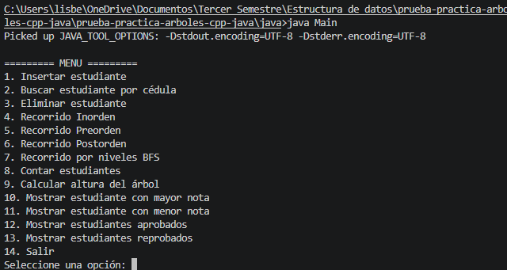

---

## Inserción de estudiantes

Se insertan estudiantes dentro del árbol utilizando la cédula como criterio principal de organización.

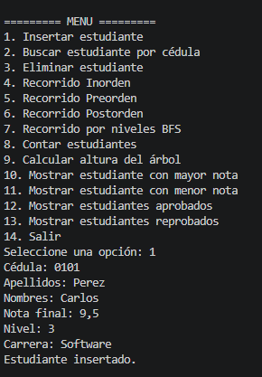

---

## Búsqueda por cédula

El sistema permite buscar estudiantes mediante la cédula ingresada por el usuario.

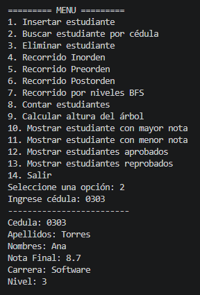

---

## Recorrido Inorden

El recorrido Inorden muestra los estudiantes ordenados de menor a mayor según la cédula.

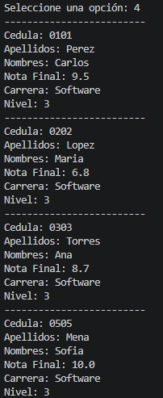

---

## Recorrido Preorden

El recorrido Preorden visita primero la raíz y luego los subárboles izquierdo y derecho.

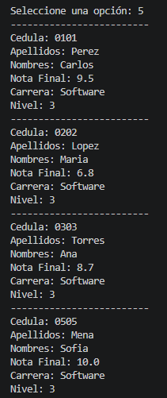

---

## Recorrido Postorden

El recorrido Postorden visita primero los nodos hijos y finalmente la raíz.

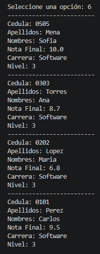

---

## Recorrido BFS por niveles

El recorrido BFS utiliza una cola para recorrer el árbol nivel por nivel.

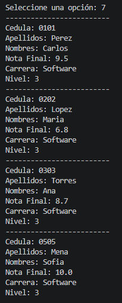

---

## Conteo de estudiantes

El sistema calcula la cantidad total de estudiantes almacenados en el árbol.

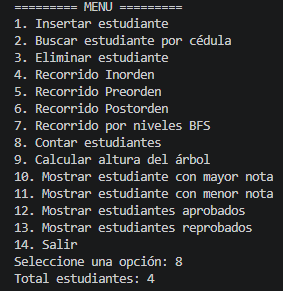

---

## Cálculo de altura del árbol

El sistema calcula la altura total del árbol binario de búsqueda.

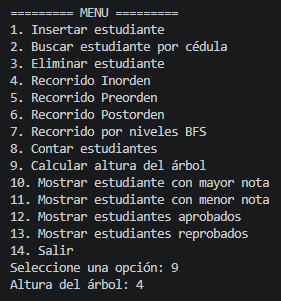

---

## Estudiante con mayor nota

El sistema busca y muestra el estudiante con la nota más alta registrada.

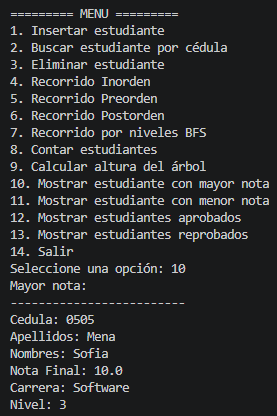

---

## Estudiante con menor nota

El sistema busca y muestra el estudiante con la nota más baja registrada.

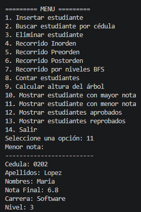

---

## Mostrar estudiantes aprobados

El sistema muestra los estudiantes con nota mayor o igual a 7.

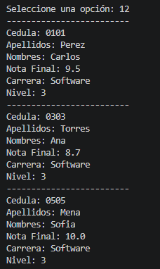

---

## Mostrar estudiantes reprobados

El sistema muestra los estudiantes con nota menor a 7.

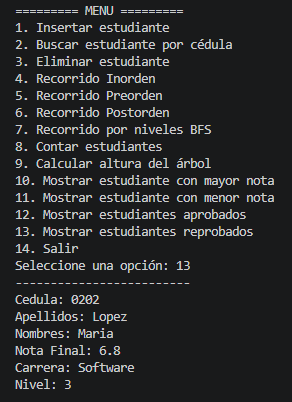

---

## Eliminación de estudiantes

El sistema elimina estudiantes manteniendo correctamente la estructura del árbol BST.

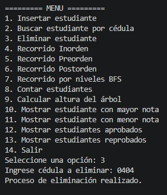

---

## Salida del sistema

El programa finaliza correctamente cuando el usuario selecciona la opción salir.

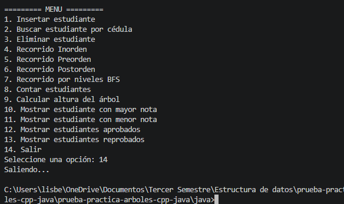